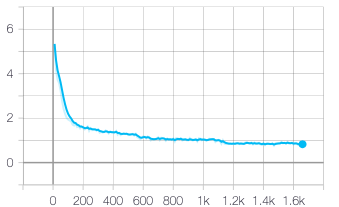
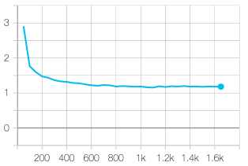

# Transfer Learning Using Diff Pruning
Sources:
 - [[Arxiv 2020 Paper]](https://arxiv.org/abs/2012.07463)
 - [[Repository]](https://github.com/dguo98/DiffPruning)

## Results

**Task 1**: finetuning [DistilBertForQuestionAnswering](https://huggingface.co/transformers/model_doc/distilbert.html#distilbertforquestionanswering) on [SQuAD](https://rajpurkar.github.io/SQuAD-explorer/)
- without diff vector
  - Exact Match:   73.2%
  - F1:   82.5%

Training loss              |  Validation loss
:-------------------------:|:-------------------------:
  |  

- with diff vector
  - Nonzero parameters: _%
  - Exact Match:   _%
  - F1:   _%
 
 Training loss              |  Validation loss
:-------------------------:|:-------------------------:

