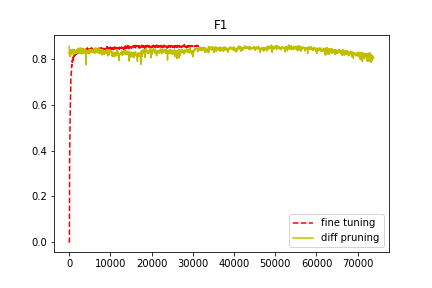

# Transfer Learning Using Diff Pruning
Sources:
 - [[Diff Pruning 2020 Paper]](https://arxiv.org/abs/2012.07463) [[Repository]](https://github.com/dguo98/DiffPruning)
 - [[BioBERT 2019 Paper]](https://academic.oup.com/bioinformatics/article/36/4/1234/5566506)

## Results

**Task 1**: finetuning [BioBERT](https://github.com/dmis-lab/biobert-pytorch) with diff-vector on [BC2GM](https://github.com/cambridgeltl/MTL-Bioinformatics-2016/tree/master/data/BC2GM-IOBES)

  - Precision:   87.69
  - Recall:   85.31
  - F1: 86.31
 

Parameter  | Value
------------ | -------------
epochs       | 80
w learning rate| 1e-5
alpha learning rate| 1e-5
weight decay | 1e-2
batch size   | 32

**Task 2**: diff pruning [BioBERT](https://github.com/dmis-lab/biobert-pytorch) with diff-vector on [BC2GM](https://github.com/cambridgeltl/MTL-Bioinformatics-2016/tree/master/data/BC2GM-IOBES)
Parameter  | Value
------------ | -------------
epochs       | 160
w learning rate| 1e-4
alpha learning rate| 1e-4
weight decay | 1e-2
batch size   | 32

  - Nonzero parameters: 20.5%
  - Precision:   86.49
  - Recall:   84.02
  - F1: 85.01
 
F1 score            |  Nonzero parameter count
:-------------------------:|:-------------------------:
  |  

Train loss shows that training beyond 160 epochs leads to the model missing optimum and the metrics above, subsequently, decreasing.

